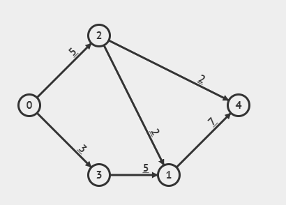

**This solution is unfinished.**

Implement the methods graph1 and graph2 that both return a Graph.

graph1 should return the following graph where node 0 is the source and node 4 is the sink.

graph2 should return a graph with 10 nodes, where there is an edge based on the parameter edges which is a 2D array. See the javadoc on how to read it.